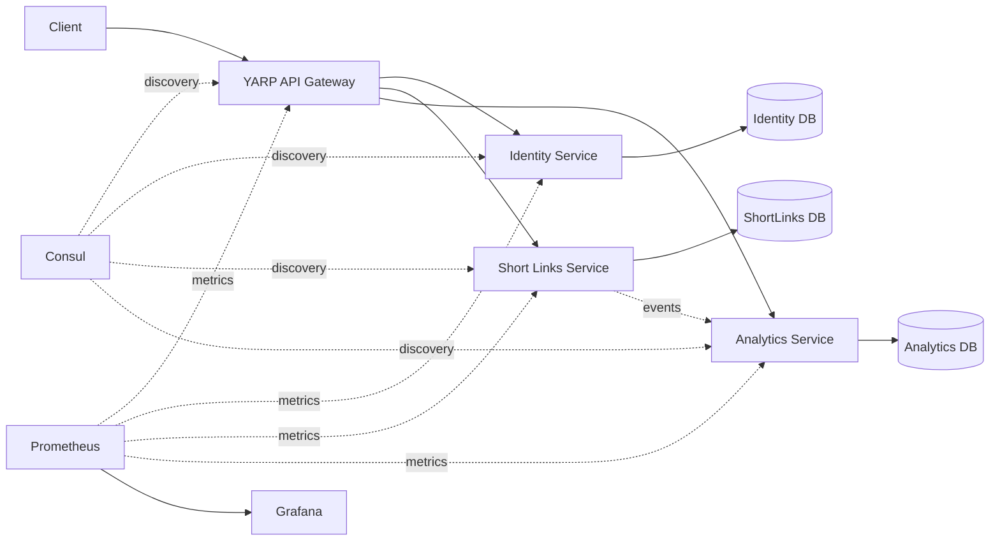

# LinkLab

> An educational .NET distributed-systems playground for exploring service boundaries, resilience, observability, idempotency, and microservice communication.


## Overview
**LinkLab** is a small educational microservices project built with .NET to explore the practical problems that appear when an application is split into independently running services.

Instead of attempting to simulate a large enterprise system, the project intentionally uses a small domain so the focus can remain on distributed-system concepts such as:

- service boundaries
- API Gateway
- service discovery
- authentication and authorization
- service-to-service communication
- resilience
- idempotency
- caching
- health checks
- correlation IDs
- observability
- distributed data ownership
The project is currently under active development.

---

## System Overview
LinkLab is based around a simple URL-shortening platform composed of independent services.


Each service is intended to own its own responsibilities and persistence instead of sharing a single application database.

---

## Services

### LinkLab.Identity.Api
Responsible for authentication and authorization.

Planned and evolving responsibilities include:

- user registration
- authentication
- JWT token generation
- roles
- policies
- permissions
- permission-based authorization
- idempotent registration flows
The service is also used to explore authorization models beyond simple role checks.

---

### LinkLab.ShortLinks.Api
Responsible for URL shortening and link management.

Core responsibilities include:

```text
Create short link
Resolve short link
Manage link ownership
Track link lifecycle
```
This service will also act as one of the main producers of events consumed by the analytics side of the system.

---

### LinkLab.Analytics.Api
Responsible for processing and exposing link analytics.

The service is intentionally separated from ShortLinks to explore asynchronous communication and eventual consistency.

Potential analytics include:

```text
Click count
Timestamp
Referrer
Client information
Aggregated statistics
```

---

### LinkLab.Gateway
The API Gateway provides a single entry point into the system.

The project uses **YARP (Yet Another Reverse Proxy)** as the gateway technology.

The gateway will be responsible for routing external traffic to the appropriate internal service.

```text
Client
   │
   ▼
Gateway
   ├── /identity  → Identity Service
   ├── /links     → ShortLinks Service
   └── /analytics → Analytics Service
```

---

## Shared Service Infrastructure
`LinkLab.ServiceDefaults` contains infrastructure behavior shared across services.

Current areas include:

```text
Consul integration
Health checks
Correlation ID middleware
Prometheus metrics
Resilient HttpClient configuration
```
The purpose of this project is to centralize common infrastructure configuration without coupling the business logic of individual services.

---

## Service Discovery
LinkLab explores dynamic service registration and discovery using **Consul**.

Instead of permanently hard-coding service addresses:

```text
http://localhost:5001
http://localhost:5002
http://localhost:5003
```
services can register themselves and be discovered through Consul.

Conceptually:

```text
Identity Service ─────┐
ShortLinks Service ───┼──► Consul
Analytics Service ────┘
                           │
                           ▼
                        Gateway
```
The project also explores service registration configuration and validation.

---

## Resilience
Distributed systems introduce failures that do not exist in the same form inside a monolithic process.

LinkLab is being used to explore scenarios such as:

```text
Timeout
Temporary network failure
503 Service Unavailable
429 Too Many Requests
Downstream service failure
```
Resilience strategies include:

- retries for transient failures
- timeout handling
- circuit breaker behavior
- resilient `HttpClient` configuration
An important goal is also understanding **when not to retry**.

For example:

```text
401 Unauthorized
Invalid input
Business-rule failure
```
should generally not be blindly retried.

---

## Idempotency
One of the main distributed-system topics explored in LinkLab is idempotency.

Consider a registration request:

```text
Client
  │
  │ POST /register
  ▼
Identity Service
  │
  ▼
Database
```
If the client does not receive the response, it may retry the request.

Without idempotency:

```text
Request 1 ──► Operation executed
Request 2 ──► Operation executed again
```
With an idempotency key:

```text
Request + Idempotency-Key
            │
            ▼
      Idempotency Store
        │         │
      New      Existing
        │         │
        ▼         ▼
     Execute   Return previous result
```
The project is being used to explore Redis-backed idempotency and the consistency problems that appear when the idempotency store and the application database can fail independently.

---

## Observability
A distributed system is difficult to debug without visibility across services.

LinkLab therefore includes infrastructure for:

### Health Checks
Services expose health information that can be used by infrastructure and monitoring components.

### Correlation IDs
A request can move across several services:

```text
Gateway
   ↓
Identity
   ↓
Another Service
```
A shared correlation identifier makes it possible to associate logs generated during the same logical request.

### Metrics
Prometheus is used as the metrics collection system, with Grafana planned as the visualization layer.

```text
Services
   │
   ▼
Prometheus
   │
   ▼
Grafana
```

---

## Technology Stack
| Technology | Purpose |
|---|---|
| **.NET** | Service implementation |
| **ASP.NET Core** | REST APIs |
| **YARP** | API Gateway |
| **SQL Server** | Service persistence |
| **Redis** | Idempotency / caching scenarios |
| **Consul** | Service discovery |
| **Prometheus** | Metrics |
| **Grafana** | Metrics visualization |
| **Docker** | Containerization |
| **Polly / .NET Resilience** | Resilient service communication |
| **JWT** | Authentication |
| **Git** | Version control |

Messaging infrastructure will be introduced as asynchronous communication scenarios are implemented.

---

## Repository Structure

```text
LinkLab/
│
├── LinkLab.Gateway/
│
├── LinkLab.Identity.Api/
│
├── LinkLab.ShortLinks.Api/
│
├── LinkLab.Analytics.Api/
│
├── LinkLab.ServiceDefaults/
│
└── linkLab.sln
```
The services are intentionally kept as separate applications.

---

## Why Separate Databases?
One of the goals of LinkLab is to avoid treating microservices as a distributed monolith.

Conceptually:

```text
Identity Service
      │
      ▼
 Identity Database

ShortLinks Service
      │
      ▼
 ShortLinks Database

Analytics Service
      │
      ▼
 Analytics Database
```
Services should not directly query each other's databases.

Information crossing service boundaries should instead move through APIs or asynchronous messages.

---

## Current Status

> 🚧 **LinkLab is an active learning project and is not yet feature-complete.**
The service boundaries and solution structure have been created, and shared infrastructure concerns are being developed incrementally.

The current development focus is primarily around the **Identity service and distributed-system infrastructure**.

---

## Roadmap

### Service Foundation

- Multi-service solution structure
- Identity service project
- ShortLinks service project
- Analytics service project
- API Gateway project
- Shared ServiceDefaults project

### Infrastructure

- Correlation ID infrastructure
- Health-check infrastructure
- Consul integration foundation
- Prometheus integration foundation
- Resilient HTTP client foundation
- Complete gateway routing
- Complete containerized local environment
- Grafana dashboards

### Identity

- Initial authorization structure
- Initial identity models
- Complete persistence layer
- Registration
- Login
- JWT authentication
- Role and permission management
- Policy-based authorization
- Redis-backed idempotency

### Short Links

- Short-link persistence model
- Create short URL
- Redirect/resolution endpoint
- Link ownership
- Validation
- Idempotent creation where appropriate

### Analytics

- Click event model
- Asynchronous click processing
- Aggregation
- Analytics endpoints

### Distributed Systems

- Message broker integration
- Event-driven communication
- Outbox pattern
- Idempotent event consumers
- Retry policies
- Circuit breaker scenarios
- Failure simulations
- Eventual consistency examples

### Testing & Operations

- Integration tests
- Container-based tests
- Service failure tests
- Observability scenarios
- Load and resilience experiments

---

## Getting Started
Clone the repository:

```bash
git clone https://github.com/MaedehShahcheraghi/LinkLab.git
cd LinkLab
```
Restore dependencies:

```bash
dotnet restore
```
Build the solution:

```bash
dotnet build
```
Full infrastructure startup instructions will be added as the Docker-based development environment is completed.

---

## Learning Objectives
This repository is not intended to demonstrate that every system should use microservices.

Instead, it is designed to answer questions such as:

- What changes when services run in separate processes?
- What happens when a downstream service is unavailable?
- When is retry safe?
- Why is idempotency important?
- How do independent databases affect consistency?
- Why do distributed systems need observability?
- How does service discovery work?
- What problem does an API Gateway solve?
- Why are message consumers required to be idempotent?
- When is eventual consistency acceptable?
- What problem does the Outbox Pattern solve?
Understanding these problems is more important than simply adding infrastructure technologies to a project.

---

## Project Philosophy
LinkLab intentionally starts small.

The objective is not to create an unnecessarily complex enterprise architecture.

New infrastructure is introduced only when there is a concrete distributed-system problem to study.

```text
Problem
   ↓
Understand the failure mode
   ↓
Introduce the pattern/tool
   ↓
Test the behavior
```
This keeps the project focused on engineering concepts rather than technology collection.

---

## Author
**Maedeh Shahcheraghi**

.NET Backend Developer

GitHub: [MaedehShahcheraghi](https://github.com/MaedehShahcheraghi)

---

## License
This project is licensed under the MIT License.
